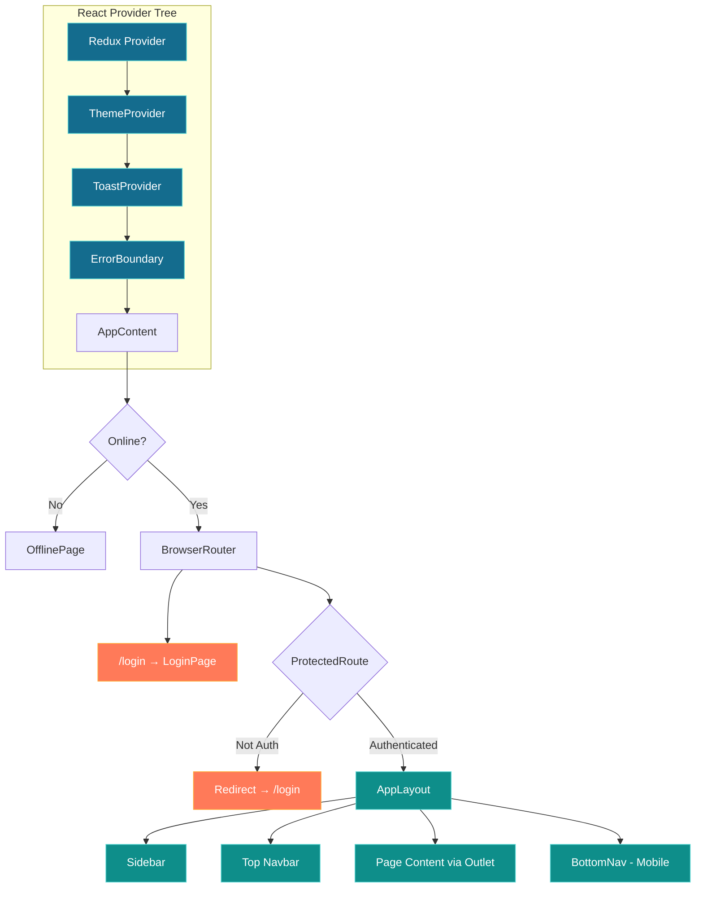
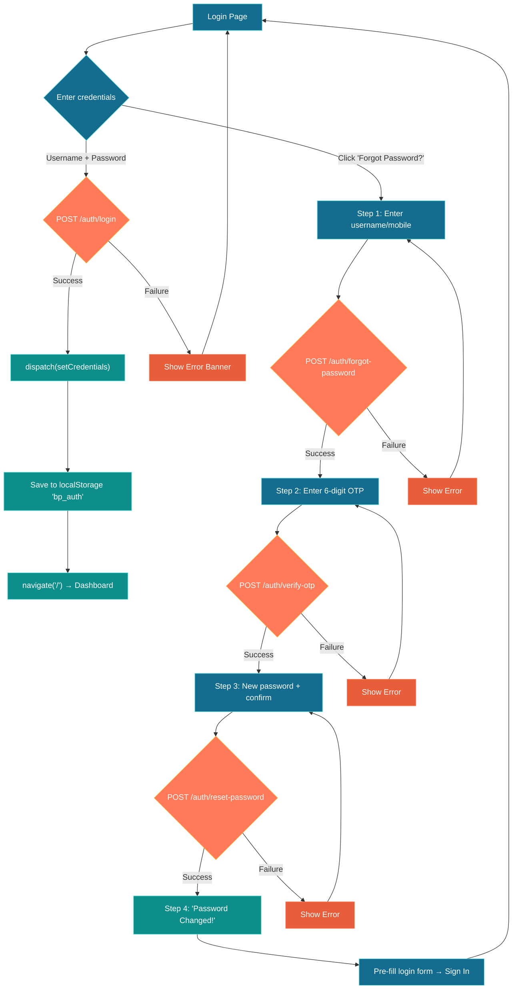
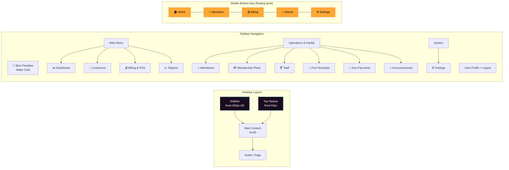
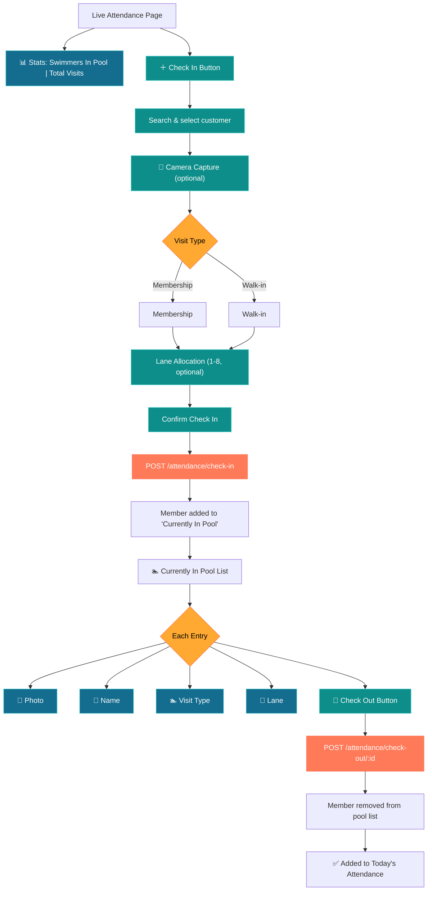
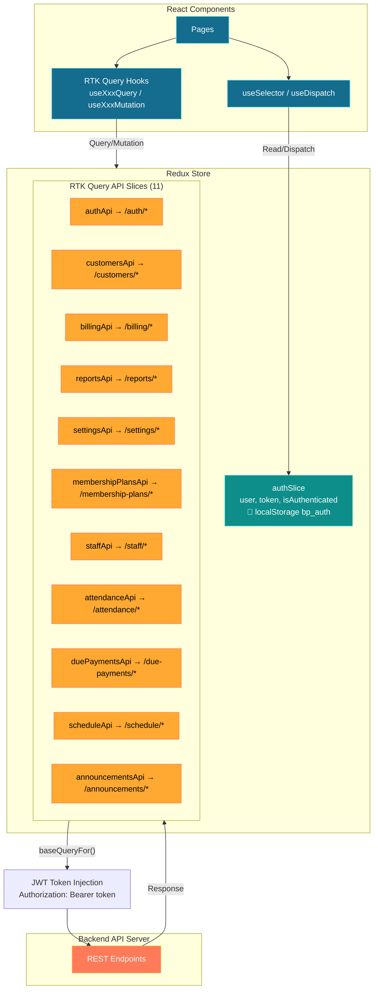
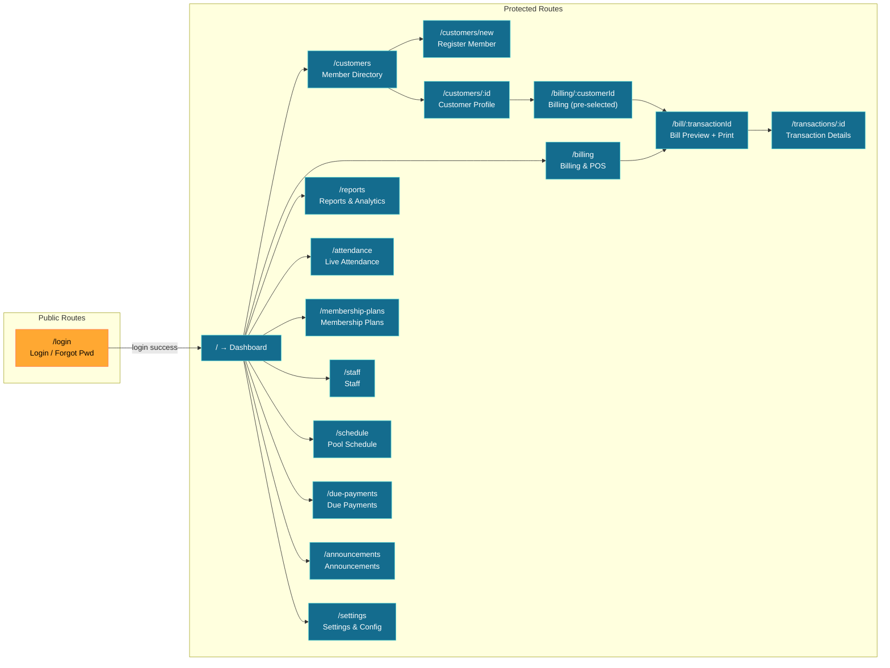
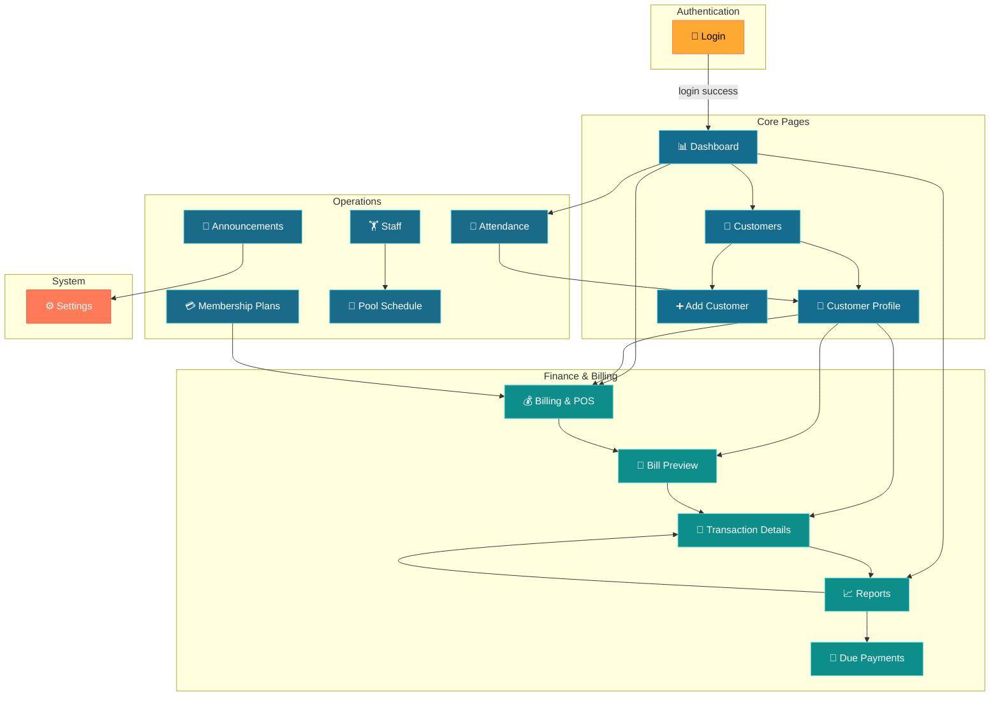

# Blue Paradise Water Club — Application Flow

> A **swimming pool & water club management system** built with React, Redux Toolkit (RTK Query), TypeScript, and Tailwind CSS.

---

## 1. High-Level Architecture

```
┌─────────────────────────────────────────────────┐
│                   App.tsx                        │
│  ┌───────────────────────────────────────────┐   │
│  │  Redux Provider (Global State)             │   │
│  │  ┌─────────────────────────────────────┐   │   │
│  │  │  ThemeProvider (Dark / Aqua Light)  │   │   │
│  │  │  ┌───────────────────────────────┐   │   │   │
│  │  │  │  ToastProvider (Notifications)│   │   │   │
│  │  │  │  ┌─────────────────────────┐   │   │   │   │
│  │  │  │  │  ErrorBoundary          │   │   │   │   │
│  │  │  │  │  ┌───────────────────┐   │   │   │   │   │
│  │  │  │  │  │  AppContent       │   │   │   │   │   │
│  │  │  │  │  │  (Router + Routes)│   │   │   │   │   │
│  │  │  │  │  └───────────────────┘   │   │   │   │   │
│  │  │  │  └─────────────────────────┘   │   │   │   │
│  │  │  └───────────────────────────────┘   │   │   │
│  │  └─────────────────────────────────────┘   │   │
│  └───────────────────────────────────────────┘   │
└─────────────────────────────────────────────────┘
```



### Technology Stack

| Layer          | Technology                                      |
| -------------- | ----------------------------------------------- |
| Framework      | React 19 (Lazy-loaded routes)                  |
| Routing        | React Router v7                                 |
| State          | Redux Toolkit + RTK Query (11 API slices)       |
| Forms          | React Hook Form + Zod validation                |
| Charts         | Recharts (bar charts)                           |
| Styling        | Tailwind CSS + CSS custom properties (glassmorphism) |
| Icons          | react-icons (Io5) + Lucide React                |
| HTTP Client    | RTK Query baseQuery (fetch wrapper)             |
| Printer        | Web Bluetooth / thermal printer service         |

---

## 2. Application Boot Sequence

```
index.html
  └─► main.tsx
        └─► <App />
              ├─ Redux Provider ─── loads store (11 API slices + auth slice)
              ├─ ThemeProvider ─── reads localStorage "bp_theme" → dark | light
              ├─ ToastProvider ─── global toast notification context
              ├─ ErrorBoundary ── catches render crashes
              └─ AppContent
                    ├─ useOnlineStatus() hook
                    │    ├─ OFFLINE → <OfflinePage /> (no routing, full stop)
                    │    └─ ONLINE  → <BrowserRouter> → Routes
                    │
                    ├─ Route: /login ──► <LoginPage /> (public)
                    │
                    ├─ Route: * (all others) ──► <ProtectedRoute>
                    │     ├─ isAuthenticated? → <AppLayout /> → <Outlet />
                    │     └─ NOT authenticated → <Navigate to="/login" />
                    │
                    └─ Wildcard fallback → Dashboard
```

---

## 3. Authentication Flow

### 3.1 Login



```
LoginPage
  │
  ├─ Email/username + Password form (Zod validated)
  │     │
  │     ├─ POST /auth/login
  │     │     ├─ Success → dispatch(setCredentials({ user, token }))
  │     │     │              ├─ Saves to localStorage "bp_auth"
  │     │     │              └─ navigate("/")
  │     │     └─ Failure → Shows error banner
  │     │
  │     └─ "Remember me" → saves username to localStorage "bp_remember"
  │
  └─ Forgot Password (multi-step wizard)
        │
        Step 1: Enter username/mobile → POST /auth/forgot-password
        │         └─ Returns demoOtp + maskedDestination
        │
        Step 2: Enter 6-digit OTP → POST /auth/verify-otp
        │         └─ Returns resetToken
        │
        Step 3: New password + confirm → POST /auth/reset-password
        │         └─ Pre-fills login form on success
        │
        Step 4: "Password Changed!" → Proceed to Sign In
```

### 3.2 Auth State Persistence

- Auth token and user are stored in `localStorage` under `bp_auth`
- On app load, `authSlice` reads from localStorage → auto-restores session
- `ProtectedRoute` checks `state.auth.isAuthenticated` on every render
- Logout: POST /auth/logout → dispatch(logout) → clears localStorage → navigate("/login")

---

## 4. Layout & Navigation

### 4.1 AppLayout (for authenticated users)



```
AppLayout
  │
  ├─ AmbientBackground (animated gradient blobs)
  │
  ├─ Sidebar (desktop: fixed left 260px / mobile: slide-in drawer)
  │     ├─ Brand header: "Blue Paradise Water Club"
  │     ├─ Main Menu:       Dashboard, Customers, Billing & POS, Reports
  │     ├─ Operations:      Attendance, Membership Plans, Staff, Schedule, Due Payments, Announcements
  │     ├─ System:          Settings
  │     └─ Footer:          User avatar + logout button
  │
  ├─ Top Navbar (fixed, 64px height)
  │     ├─ Mobile: Hamburger toggle + Logo
  │     ├─ Global Search (⌘K / Ctrl+K) → opens SearchModal
  │     ├─ "New Bill" quick action (desktop)
  │     ├─ Theme toggle (dark ↔ light)
  │     ├─ Notifications bell → navigates to /announcements
  │     └─ User profile pill → navigates to /settings
  │
  ├─ <Outlet /> ─── page content
  │
  └─ BottomNav (mobile only, floating glass dock)
        ├─ Home (🏠)
        ├─ Members (👥)
        ├─ Billing (💰 center, elevated button)
        ├─ Attendance (👟)
        └─ Settings (⚙️)
```

### 4.2 Search Modal (⌘K)

```
SearchModal
  │
  ├─ Input: type ≥ 2 chars
  │     └─ GET /customers?search=<query>
  │
  └─ Results → click customer → navigate("/customers/:id")
```

---

## 5. Page-by-Page Flow

### 5.1 Dashboard (`/`)

```
DashboardPage
  │
  ├─ Greeting (Good Morning/Afternoon/Evening, {username})
  ├─ Club Timing card (open time — close time, "Open Now" badge)
  │
  ├─ Stats row:
  │     ├─ Total Customers ← GET dashboard stats
  │     ├─ Today's Visits
  │     └─ Today's Revenue
  │
  ├─ Quick actions:
  │     ├─ "New Customer" → /customers/new
  │     └─ "New Billing" → /billing
  │
  └─ Today's Transactions list ← GET today transactions
        └─ Click transaction → /transactions/:id
```

### 5.2 Customers (`/customers`)

```
CustomerListPage
  │
  ├─ Search bar (name, phone, Aadhaar)
  ├─ Filter chips: All | New Members | Membership
  │
  ├─ GET /customers?search=&type=
  │
  ├─ Customer cards → click → /customers/:id
  │     ├─ Avatar (photo or initials)
  │     ├─ Name, Mobile, Aadhaar
  │     └─ ID Verified badge (if idCardPhoto exists)
  │
  └─ "Register Member" button → /customers/new
```

### 5.3 Add Customer (`/customers/new`)

```
AddCustomerPage
  │
  ├─ Multi-step form:
  │     Step 1: Personal Info (name, mobile, age, gender, address)
  │     Step 2: ID Verification (Aadhaar number + ID card photo via camera)
  │     Step 3: Profile Photo (camera capture)
  │     Step 4: Review & Confirm
  │
  ├─ CameraCaptureModal → device camera → photo as data URL
  │
  └─ POST /customers → success → /customers/:id
```

### 5.4 Customer Profile (`/customers/:id`)

```
CustomerProfilePage
  │
  ├─ Breadcrumb: Customers > {name}
  ├─ Hero card (avatar, name, mobile, address, "Active Member" badge)
  │     ├─ "New Billing" → /billing/:customerId
  │     ├─ "Update Face Photo" → CameraCaptureModal
  │     └─ "Call" → tel:{mobile}
  │
  ├─ Stats: Total Visits | Total Spent | Transactions | Member Since
  │
  ├─ Tabs:
  │     ├─ Overview:
  │     │     ├─ Photo & ID Verification (profile photo + ID card snap)
  │     │     ├─ Personal Information (name, mobile, Aadhaar, age, gender, address)
  │     │     ├─ Current Membership status
  │     │     └─ Recent Activity (last 3 visits)
  │     │
  │     ├─ Visits:
  │     │     └─ Timeline view of all visits
  │     │
  │     ├─ Membership:
  │     │     └─ List of memberships (Active / Expired / Cancelled)
  │     │
  │     └─ Payments:
  │           ├─ Total payments summary
  │           └─ Transaction list → click → /transactions/:id
  │
  └─ API calls: GET customer, GET visits, GET transactions, GET memberships
```

### 5.5 Billing & POS (`/billing`)

```mermaid
flowchart TD
    Start["Billing & POS Page"] --> Step1["Step 1: Select Customer"]
    Step1 --> SearchC["Search by name/mobile"]
    SearchC --> PickC{"Pick customer"}
    PickC -->|Found| Step2["Step 2: Select Service"]
    PickC -->|Not found| NewC["Register New Member → /customers/new"]

    Step2 --> ShowC{"Pre-selected?<br/>/billing/:customerId"}
    ShowC -->|Yes| SkipToService["Auto-skip to Step 2"]
    ShowC -->|No| SelectService["Choose service card"]

    SelectService --> SvcCards{"Service Type"}
    SvcCards -->|Membership| Price1["General Membership ₹1,500"]

    Price1 --> Step3["Step 3: Collect Payment"]

    Step3 --> Summary["Order Summary Card"]
    Summary --> PayMethod{"Payment Method"}
    PayMethod -->|Cash| Cash["💵 Cash"]
    PayMethod -->|UPI/QR| UPI["📱 UPI / QR"]
    PayMethod -->|Card| Card["💳 POS Card"]

    Cash --> Confirm["Confirm & Generate Bill"]
    UPI --> Confirm
    Card --> Confirm

    Confirm --> Modal{"Confirmation Modal"}
    Modal -->|Cancel| Step3
    Modal -->|"Pay Now"| API["POST /billing/transactions"]
    API -->|Success| BillPage["→ /bill/:transactionId<br/>Bill Preview + Print"]
    API -->|Failure| ErrModal["Error Modal + Toast"]
    ErrModal --> Step3

    classDef step fill:#146C8E,stroke:#5FD9D6,color:#fff
    classDef action fill:#0E8E8A,stroke:#5FD9D6,color:#fff
    classDef decision fill:#FFA832,stroke:#FF7A59,color:#000
    classDef api fill:#FF7A59,stroke:#FFA832,color:#fff
    classDef error fill:#E85D3A,stroke:#FF7A59,color:#fff
    class Step1,Step2,Step3 step
    class SearchC,ShowC,PickC,SelectService,SvcCards summary action
    class Modal,PayMethod decision
    class API api
    class ErrModal error
```

```
BillingPage
  │
  ├─ 3-Step Stepper:
  │
  │  Step 1: Select Customer
  │    ├─ Search bar (name or mobile)
  │    ├─ GET /customers?search=
  │    ├─ Customer list → click to select
  │    └─ "New Member" → /customers/new
  │
  │  Step 2: Select Service
  │    ├─ Shows selected customer card (with "Change" button)
  │    ├─ Service cards:
  │    │     └─ General Membership ── ₹1,500
  │    └─ "Continue to Payment" → step 3
  │
  │  Step 3: Collect Payment
  │    ├─ Order summary (customer, service, amount)
  │    ├─ Payment method selector: Cash | UPI/QR | POS Card
  │    ├─ "Confirm & Generate Bill" → confirmation modal
  │    │
  │    └─ On confirm:
  │          POST /billing/transactions
  │          ├─ Success → showToast → navigate("/bill/:transactionId")
  │          └─ Failure → error modal + toast
  │
  └─ Side panel (desktop): Quick summary + Service pricing
```

### 5.6 Bill Preview (`/bill/:transactionId`)

```
BillPreviewPage
  │
  ├─ GET /billing/transactions/:id
  ├─ ReceiptCard component:
  │     ├─ Business info (name, logo, address)
  │     ├─ Customer info
  │     ├─ Service details + amount
  │     ├─ Payment method
  │     └─ Bill footer text
  │
  └─ "Print Receipt" → printerService.printReceipt()
```

### 5.7 Reports (`/reports`)

```
ReportsPage
  │
  ├─ Period filters: Daily | Monthly | Yearly
  │
  ├─ Stats row: Total Revenue | Transactions | Avg. Sale | Revenue/Period
  │
  ├─ Revenue Trend (stacked bar chart via Recharts)
  │     └─ Membership (teal)
  │
  ├─ Revenue by Category (progress bars with % breakdown)
  │
  └─ Recent Transactions list (last 10)
        └─ Click → /transactions/:id
```

### 5.8 Transaction Details (`/transactions/:id`)

```
TransactionDetailsPage
  │
  ├─ GET /billing/transactions/:id
  ├─ Full receipt view with:
  │     ├─ Bill number, date/time
  │     ├─ Customer details
  │     ├─ Service name + amount
  │     ├─ Payment method
  │     └─ Print button
```

### 5.9 Attendance (`/attendance`)



```
AttendancePage
  │
  ├─ Stats: Swimmers In Pool | Total Visits Today
  │
  ├─ "Check In" button → opens check-in form:
  │     ├─ Search & select customer
  │     ├─ Camera capture (optional verification photo)
  │     ├─ Visit type: Membership | Walk-in
  │     ├─ Lane allocation (1-8, optional)
  │     └─ POST /attendance/check-in
  │
  ├─ Currently In Pool list:
  │     └─ Each entry: photo, name, visit type, lane
  │           └─ "Check Out" button → POST /attendance/check-out/:id
  │
  └─ Today's Attendance history
```

### 5.10 Staff (`/staff`)

```
StaffPage
  │
  ├─ Staff roles: Lifeguard | Receptionist | Manager
  │
  ├─ Staff directory (cards with photo, name, role, specialization)
  │
  ├─ Add new staff form:
  │     ├─ Name, mobile, role, specialization
  │     ├─ Photo capture (optional)
  │     └─ POST /staff
  │
  └─ Toggle availability (active/inactive)
```

### 5.11 Membership Plans (`/membership-plans`)

```
MembershipPlansPage
  │
  ├─ Plan cards (grid layout):
  │     ├─ Duration badge (Hourly / Daily / Monthly / Quarterly / Yearly)
  │     ├─ Plan name, price, description
  │     ├─ Feature checklist
  │     └─ Edit / Delete buttons
  │
  ├─ "New Plan" form:
  │     ├─ Name, price, duration selector
  │     ├─ Description (textarea)
  │     ├─ Features (comma-separated input)
  │     └─ POST /membership-plans (create) or PUT (update)
  │
  └─ Delete → confirmation modal → DELETE /membership-plans/:id
```

### 5.12 Pool Schedule (`/schedule`)

```
SchedulePage
  │
  ├─ View toggle: Week | Day
  │
  ├─ Week view: 7-day tabs with slot counts
  ├─ Day view: filtered slots for selected day
  │
  ├─ Slot types:
  │     ├─ Lane (teal) ── lane number + capacity
  │     └─ Open Swim (blue) ── general capacity
  │
  ├─ Stats: Total Slots | Lane Sessions | Open Swim
  │
  ├─ "Add Slot" form:
  │     ├─ Day, start/end time, type
  │     ├─ Lane number (for lane sessions)
  │     ├─ Max capacity
  │     └─ POST /schedule (create) or PUT (update)
  │
  └─ Delete slot → confirmation modal → DELETE /schedule/:id
```

### 5.13 Due Payments (`/due-payments`)

```
DuePaymentsPage
  │
  ├─ Summary: Pending (₹) | Overdue (₹) | Total Due (count)
  │
  ├─ Status filters: All | Pending | Overdue | Paid
  │
  ├─ "Add Due" form:
  │     ├─ Search & select customer
  │     ├─ Description, amount, due date
  │     └─ POST /due-payments
  │
  ├─ Payment list:
  │     ├─ Each: customer name, description, amount, status badge
  │     ├─ "Pay" button → confirmation → POST /due-payments/:id/pay
  │     └─ "Delete" button → confirmation → DELETE /due-payments/:id
  │
  └─ Status indicators:
        ├─ PENDING (aqua)
        ├─ OVERDUE (coral + alert icon)
        └─ PAID (aqua badge)
```

### 5.14 Announcements (`/announcements`)

```
AnnouncementsPage
  │
  ├─ Priority badges: Low | Medium | High
  │
  ├─ Announcement list (title, message, priority, date)
  │     └─ Expired announcements are dimmed
  │
  ├─ "Create Announcement" form:
  │     ├─ Title, message, priority level
  │     ├─ Active toggle + expiry date
  │     └─ POST /announcements
  │
  └─ Edit / Delete existing announcements
```

### 5.15 Settings (`/settings`)

```
SettingsPage
  │
  ├─ Theme Toggle: Dark Ocean ↔ Aqua Light
  │     └─ localStorage "bp_theme"
  │
  ├─ Printer:
  │     ├─ Status: Connected (model) / Disconnected
  │     └─ "Test Print" → printerService.testPrint()
  │
  ├─ Business Info:
  │     ├─ Business name, bill prefix, bill footer
  │     └─ PUT /settings
  │
  ├─ Club Timing:
  │     ├─ Opening / closing time
  │     ├─ Operating days (Mon–Sun badges)
  │     └─ PUT /settings
  │
  ├─ Change Password:
  │     ├─ Current password + new password
  │     └─ POST /auth/change-password
  │
  └─ Logout button → POST /auth/logout → clear state → /login
```

---

## 6. Data Flow (Redux Store)



```
Redux Store
  │
  ├─ authSlice (localStorage-persisted)
  │     └─ { user, token, isAuthenticated }
  │
  ├─ RTK Query API Slices (11 total):
  │     ├─ authApi        → /auth/*
  │     ├─ customersApi   → /customers/*
  │     ├─ billingApi     → /billing/*
  │     ├─ reportsApi     → /reports/*
  │     ├─ settingsApi    → /settings/*
  │     ├─ membershipPlansApi → /membership-plans/*
  │     ├─ staffApi       → /staff/*
  │     ├─ attendanceApi  → /attendance/*
  │     ├─ duePaymentsApi → /due-payments/*
  │     ├─ scheduleApi    → /schedule/*
  │     └─ announcementsApi → /announcements/*
  │
  └─ All API slices use baseQueryFor() with JWT token injection
        └─ Authorization: Bearer <token> header
```

---

## 7. Key Cross-Cutting Features

### 7.1 Offline Detection

```
useOnlineStatus() hook
  ├─ navigator.onLine + online/offline events
  ├─ ONLINE → render app normally
  └─ OFFLINE → <OfflinePage /> with retry button
```

### 7.2 Theme System

```
useTheme() hook
  ├─ Reads localStorage "bp_theme"
  ├─ Applies CSS class "dark" | "light" on <html>
  ├─ CSS variables: --bg-deep, --accent-aqua, --glass-bg, etc.
  └─ toggleTheme() → flips and persists
```

### 7.3 Toast Notifications

```
useToast() → showToast(type, message)
  ├─ type: success | error | warning | info
  ├─ Auto-dismiss after ~3 seconds
  └─ Renders as floating glass card at top of screen
```

### 7.4 Camera Capture

```
CameraCaptureModal
  ├─ Guide modes: avatar | document | general
  ├─ Uses getUserMedia API (front or rear camera)
  ├─ Captures frame → returns data URL (base64)
  └─ Used in: AddCustomer, AttendanceCheckIn, CustomerProfile
```

### 7.5 Printer Integration

```
printerService (src/services/printer.ts)
  ├─ getStatus() → { connected, model }
  ├─ testPrint() → sends test receipt
  └─ printReceipt(data) → thermal receipt with business info, customer, service
```

---

## 8. Route Map Summary



| Path                      | Page                  | Auth Required |
| ------------------------- | --------------------- | ------------- |
| `/login`                  | Login / Forgot Pwd    | No            |
| `/`                       | Dashboard             | Yes           |
| `/customers`              | Customer List         | Yes           |
| `/customers/new`          | Add Customer          | Yes           |
| `/customers/:id`          | Customer Profile      | Yes           |
| `/billing`                | Billing & POS         | Yes           |
| `/billing/:customerId`    | Billing (pre-selected)| Yes           |
| `/bill/:transactionId`    | Bill Preview          | Yes           |
| `/reports`                | Reports & Analytics   | Yes           |
| `/transactions/:id`       | Transaction Details   | Yes           |
| `/attendance`             | Live Attendance       | Yes           |
| `/staff`                  | Staff       | Yes           |
| `/membership-plans`       | Membership Plans      | Yes           |
| `/schedule`               | Pool Schedule         | Yes           |
| `/due-payments`           | Due Payments          | Yes           |
| `/announcements`          | Announcements         | Yes           |
| `/settings`               | Settings & Config     | Yes           |

---

## 9. User Journey (Typical Day)

```mermaid
flowchart LR
    A["1. 🌅 Staff opens app"] --> B{"2. 🔐 Login"}
    B --> C["3. 📊 Dashboard<br/>greeting + today's stats"]

    C --> D["4. 🏊 Member arrives<br/>at gate"]
    D --> E["5. ✅ Attendance Check In<br/>search + photo + lane"]

    E --> F["6. 💰 Walk-in wants<br/>pool access"]
    F --> G["7. 🧾 Billing → Service<br/>→ Payment → Print receipt"]

    G --> H["8. 🔄 Member renews<br/>membership"]
    H --> I["9. 💳 Billing → Membership<br/>→ Pay → Print pass"]

    I --> J["10. 📈 Manager reviews<br/>daily revenue"]
    J --> K["11. 📊 Reports → Charts<br/>+ transaction list"]

    K --> L["12. 🚪 Member leaves pool"]
    L --> M["13. ✅ Attendance Check Out"]

    M --> N["14. 📅 Admin updates<br/>pool schedule"]
    N --> O["15. 📢 Admin posts<br/>announcement"]

    O --> P["16. 🌙 End of day →<br/>Settings → Logout"]

    classDef morning fill:#5FD9D6,stroke:#146C8E,color:#000
    classDef action fill:#FFA832,stroke:#FF7A59,color:#000
    classDef admin fill:#FF7A59,stroke:#E85D3A,color:#fff
    class A,B,C morning
    class D,E,F,G,H,I,J,K,L,M action
    class N,O,P admin
```



```
1. Staff opens app
   └─► Online check → Login page

2. Login with credentials
   └─► Dashboard shows greeting + today's stats

3. Member arrives at gate
   └─► Attendance → Check In (search member, optional photo, assign lane)

4. Walk-in customer wants pool access
   └─► Billing → Select customer → Service → Collect payment → Print receipt

5. Customer wants to renew membership
   └─► Billing → Select customer → General Membership → Pay → Print pass

6. Manager reviews daily revenue
   └─► Reports → Daily view → Charts + transaction list

7. Staff member leaves pool
   └─► Attendance → Check Out (tap button next to their name)

8. Admin updates pool schedule for next week
   └─► Schedule → Add Slot → Pick day, time, type, capacity

9. Admin posts an announcement
   └─► Announcements → Create → "Pool closed Tuesday for maintenance"

10. End of day
    └─► Settings → Logout
```

---

## 10. Page Relationship Map



---

*Generated with Codebuff 🤖*
